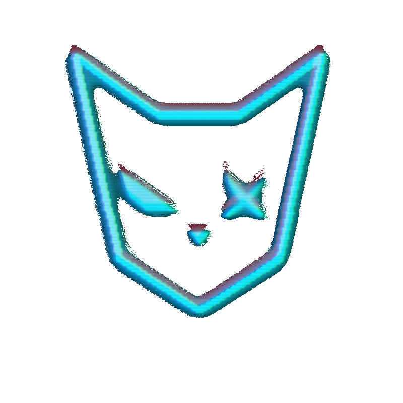

<div align="center">
  

# ᗢ Neko GPT

A cyberpunk styled web chat interface powered by **NEKO API** for:
**chat completions**, **image generation**, **vision analysis**, and **image editing (up to 4 images)** using the **latest Seedance model**.

<p>
  <a href="https://github.com/ARCANGEL0/NekoGPT/stargazers"></a>
  <a href="https://github.com/ARCANGEL0/NekoGPT/watchers"></a>
  <a href="https://github.com/ARCANGEL0/NekoGPT/network/members"></a>
  <a href="https://github.com/ARCANGEL0/NekoGPT/issues"></a>
</p>

[](https://github.com/ARCANGEL0/NekoCLI)

</div>

---

# About
- Text completions chat with Neko API using realtime data.
- Image generation using latest seedance models.
- Vision analysis when an image is attached in chat mode.
- Multi-image editing workflow (up to 4 images) in image mode.
- Session-based chat history saved in browser.

## ⚡ Neko Modes
| Mode | Behavior |
|---|---|
| `CHAT` | Text conversation + optional single-image vision prompt |
| `IMAGE` | Prompt image generation or image edit with up to 4 files |

## ⛃ Tech Stack
- Next.js 15 + React 19 + TypeScript
- Tailwind CSS + shadcn/ui + Radix UI
- Cyberpunk styling using the Neko UI layer

## ➤_ Quick Start
```bash
git clone https://github.com/ARCANGEL0/NekoGPT.git
cd NekoGPT
npm install
npm run dev
```

Open `http://localhost:3000`.

## ⧖ Build
```bash
npm run build
npm start
npm run lint
```

## ⮼ Project Structure
```text
app/                  # app routes + API handlers
components/           # main UI modules for neko chat
components/ui/        # reusable UI comps
hooks/                # state hooks and others
lib/                  # store and utility logic for cchat wrapper
public/               # static assets (gifs, imgs, sounds)
```

---

<div align="center">

### Support

[](https://github.com/ARCANGEL0/NekoGPT)
[](https://github.com/ARCANGEL0)

<a href='https://ko-fi.com/J3J7WTYV7' target='_blank'></a>

<strong>Hack the world. Byte by Byte.</strong> ⛛ <br>
𝝺𝗿𝗰𝗮𝗻𝗴𝗲𝗹𝗼 @ 2026

</div>
